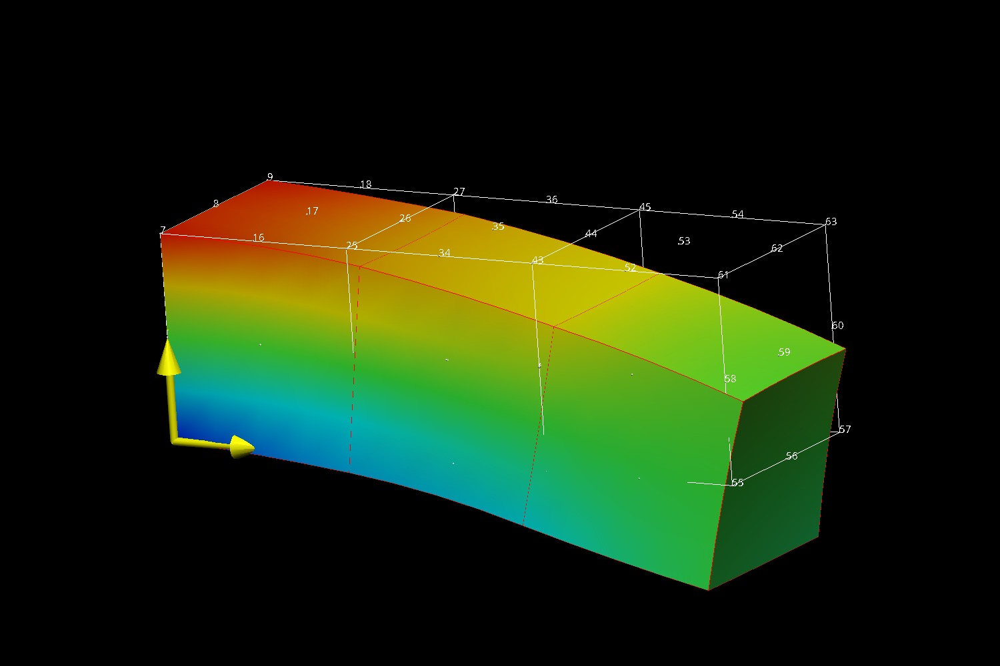

===========================
Gauss Point Fitting Example
===========================

This example solves a finite elasticity cantilever problem, evaluates a Gauss
point field of the Cauchy stresses and then fits a nodal field to the Gauss
point stresses.

Running the example
===================

To run the example:

  cd ./fitting_gauss_stress/src/python
  source  /path/to/opencmisslibs/install/.../.../virtualenvironments/oclibs_pyXY_release/bin/activate
  python fitting_gauss_stress.py
  
  Note: If the above fails, try the following.
  cd ./fitting_gauss_stress/src/python
  PYTHONPATH="/path/to/opencmisslibs/install/.../.../Release/opencmiss.iron" python fitting_gauss_stress.py  

The example also takes a number of optional arguments, namely either

  python fitting_gauss_stress.py numberOfXElements numberOfYElements numberOfZElements

or

  python fitting_gauss_stress.py numberOfXElements numberOfYElements numberOfZElements tauSmoothingParameter kappaSmoothingParameter

where numberOfXElements, numberOfYElements and numberOfZElements are the
number of elements in the X, Y and Z direction in the
cantilever. tauSmoothingParameter and kappaSmoothingParameter are the Sobelov
smoothing parameters for the fitting problem. tauSmoothingParameter controls
the amount of tension in the fit and kappaSmoothingParameter controls the
amount of curvature in the fit.

Verifying the example
=====================

Results can be visualised by running `visualise.cmgui <./src/python/visualise.cmgui>`_ with the `Cmgui visualiser <http://physiomeproject.org/software/opencmiss/cmgui/download>`_.

The following figure shows the expected results.  
 

   :align: middle
   :width: 250
   :scale: 100
